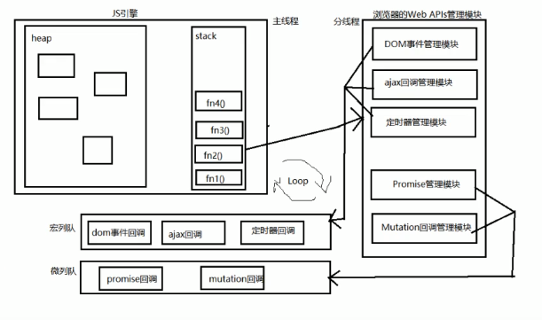

说说你对事件执行机制的理解

首先任务进入 任务执行栈

判断是同步任务还是异步任务

同步的话 进入主线程，

异步的的话， 进入 Event table 并注册函数，进行执行，有结果后 放入 Event queue

如果主线程任务执行完毕为空，就进入 Event queue 读取对应的函数进入主线程执行

这个过程不断重复，就是 event loop 事件循环 机制

event queue 中的还会分为 macro-task (宏任务) micro -task (微任务 )
首先执行 所有的微任务 ，然后执行宏任务，如果执行完毕，在看看有没有需要执行的微任务，
就这样循环执行，知道代码执行完毕

https://www.cnblogs.com/shcrk/p/9325779.html

JS 为什么是单线程的？

JavaScript 语言的一大特点就是单线程，也就是说，同一个时间只能做一件事。那么，为什么 JavaScript 不能有多个线程呢？这样能提高效率啊。
JavaScript 的单线程，与它的用途有关。作为浏览器脚本语言，JavaScript 的主要用途是与用户互动，以及操作 DOM。
这决定了它只能是单线程，否则会带来很复杂的同步问题。比如，假定 JavaScript 同时有两个线程，
一个线程在某个 DOM 节点上添加内容，另一个线程删除了这个节点，这时浏览器应该以哪个线程为准？
所以，为了避免复杂性，从一诞生，JavaScript 就是单线程，这已经成了这门语言的核心特征，将来也不会改变。
为了利用多核 CPU 的计算能力，HTML5 提出 Web Worker 标准，允许 JavaScript 脚本创建多个线程，
但是子线程完全受主线程控制，且不得操作 DOM。所以，这个新标准并没有改变 JavaScript 单线程的本质。

JS 为什么需要异步?
　　如果 JS 中不存在异步，只能自上而下执行，如果上一行解析时间很长，那么下面的代码就会被阻塞。
对于用户而言，阻塞就意味着"卡死"，这样就导致了很差的用户体验。

JS 单线程又是如何实现异步的呢？
　　既然 JS 是单线程的，只能在一条线程上执行，又是如何实现的异步呢？
　　是通过的事件循环(event loop)，理解了 event loop 机制，就理解了 JS 的执行机制。
