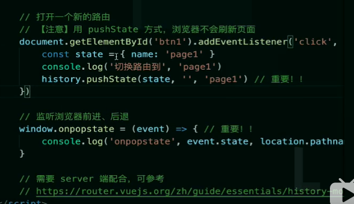

[toc]

#### 17.vue-router 使用

路由模式 （hash,H5 history）
hash 模式 ，#/user/10 一般都用这个
h5 history /user/20 需要 server 端的支持，因此无特殊需求可选择前者
路由配置（动态路由,懒加载）

```
path:
compontent：
children:
```

路由懒加载 就和上面的异步动态组件一样 import 引入组件

#### 2. router 和 route 的区别

route 相当于当前正在跳转的路由对象。。可以从里面获取 name,path,params,query 等。。

route 是 new VueRouter 的实例，有很多实例对象，push,go,back
const router = new VueRouter({
routes: [
{ path: '/search', component: SearchUser, props: (route) => ({ query: route.query.q }) }
]
})

#### 3.路由传参

1.query 使用 path 和 name 传参都可以，而 params 只能使用 name 传参。

query 传参：

2.传参时 query 不需要再路由上配参数，params 也可以不用配，

但是 params 不配的话，当用户刷新当前页面的时候，

参数就会消失。也就是说使用 params 不在路由配参数跳转，

只有第一次进入页面参数有效，刷新页面参数就会消失。

1、声明式 router-link

```
//子路由配置
{
  path: '/child/:id',
  component: Child
}
//父路由组件
<router-link :to="/child/123">进入Child路由</router-link>

```

2、编程式 this.\$router.push

```
//子路由配置
{
  path: '/child/:id',
  component: Child
}
//父路由编程式传参(一般通过事件触发)
this.$router.push({
    path:'/child/${id}',
})
```

接收方式

this.\$route.params.id

#### 3.路由是只能传参的

#### 18.路由钩子

全局路由钩子
beforeEach 主要有 3 个参数 to，from，next：

#### 19.路由的原理

即浏览器的前景、后退
hash 变化不会刷新页面，spa 必需的特点
hash 永远不会提交到 server 端，

1）通过监听 hash 的变化
window.onhashchange 可以监听到 oldhash newhash

2）DOMContentLoaded 页面加载完后 获取 hash 的变化
document.addEventListener('DOMContentLoaded',()=>{})

3）浏览器的前进和后退

4）手动修改

用 url 规范的路由，跳转时不刷新页面
history.pushState
window.onpopstate

需要后台配置支持：如果 URL 匹配不到任何静态资源，就应该返回同一个 index.html


#### 16.vuex 使用

#### 20.vuex 的执行过程

#### 23.\$route 和\$router 的区别

答：\$route 是“路由信息对象”，包括 path，params，hash，query，fullPath，matched，name 等路由信息参数。

而\$router 是“路由实例”对象包括了路由的跳转方法，钩子函数等。

#### 19. 谈一下，你对 mvvm，mvc 原理的理解

mvc 前端到后台 ，前端就是视图层， 数据是单向的，
对前端用重新划分了一下

传统的 mvc 指的是 用户操作会请求服务端的路由，路由会调用对应的控制器来处理，控制器会获取数据，将结果返回给前端，页面重新渲染

mvvm 传统的前端会将数据手动渲染到页面上，MVVM 模式不需要用户收到操作 dom 元素，将数据绑定到 viewModel 层上，会自动将数据渲染到页面中，视图变化会通知 viewModel 层更新数据，ViewModel 就是 MVVM 模式的桥梁

在 MVVM 架构下，View 和 Model 之间并没有直接的联系，而是通过 ViewModel 进行交互。

Model 和 ViewModel 之间的交互是双向的， 因此 View 数据的变化会同步到 Model 中，而 Model 数据的变化也会立即反应到 View 上。

ViewModel 通过双向数据绑定把 View 层和 Model 层连接了起来，而 View 和 Model 之间的同步工作完全是自动的，无需人为干涉。

因此开发者只需关注业务逻辑，不需要手动操作 DOM, 不需要关注数据状态的同步问题，复杂的数据状态维护完全由 MVVM 来统一管理。
