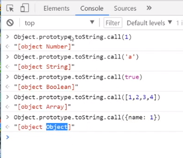
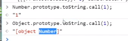
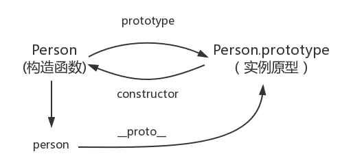
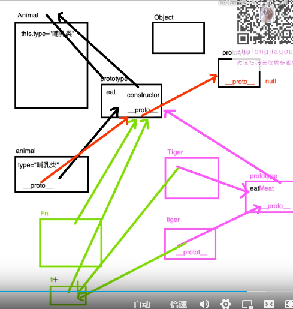
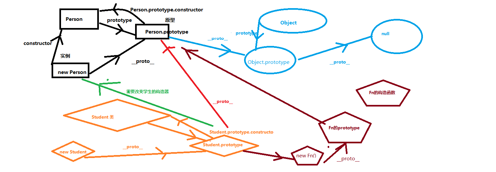

```
    function Car() {
      this.color = 'red'
      this.brand = 'benz'
      return true
    }
    var car = new Car()
    console.log(car)
```

当 return 中返回一个引用类型的值，实例就指向这个引用类型，如果是基本类型，return 不起作用

prototype 是定义构造函数构造出的每个对象的公共祖先
所有被该构造函数构造出的对象都可以继承原型上的属性和方法
自己有的就用自己的，自己没有的就看原型上有吗

方法写在原型上

原型链的终点是 Object.prototype

Object.create(对象/null) 生成的对象，方法和属性都在原型上,使用说明,里面放的对象是原型

```
var obj1=Object.create(null)//创建空对象
obj1.num=1;
var obj2=Object.creat(obj1)

```

不是所有的对象都继承于 Object.prototype

```
var obj=Object.create(null)
obj.num=1;
obj.toString() //报错
var obj2={age:1}
obj.__proto__=obj2
console.log(obj.age)
```

unberfined null 有 toString()方法吗?
原因：，原始值没有属性而且 没有包装类，2.没有原型

```
undefined.toString()
null.toString()
```

```
var num=1;
num.toString()
var num2=new Numer(num)
consol.log(num2.toString()) //他调用的自身的 toString()方法
```

```
var num=1;
var obj={};
var obj2=Object.create(null);
document.write(num)
document.write(obj)
document.write(obj2)

```

为什么 obj2 报错，因为它不能隐式转换，调用 toString(),没有原型，所以不能继承 Object.prototype 上的方法和属性

为什么 Number 的实例原型上 要重写一个 toString()






因为 object 上的 toString()方法实现不了 number 想要的功能，所以要重写

```

```
