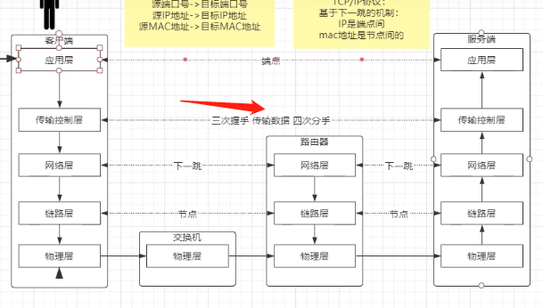
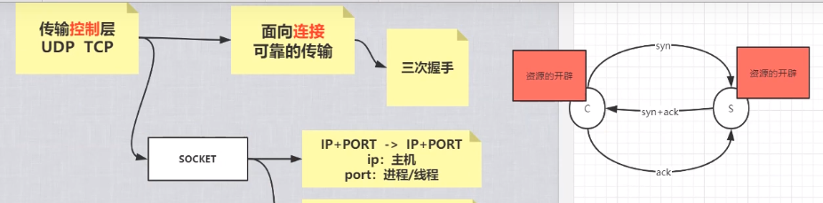
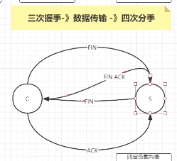
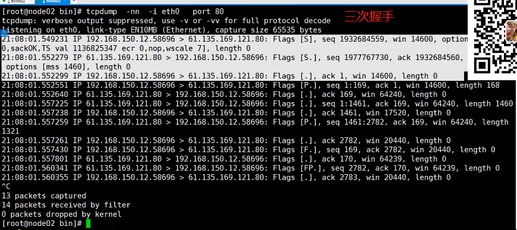

一、`网络分层`：

应用层
传输控制层
网络层
链路层
物理层

二、 什么是 `tcp`

tcp 是面向连接 （三次握手）
可靠的传输

三、什么是三次握手

四、为什么需要三次握手不是两次
最后一次需要确认客户端是否收到数据包

经过三次握手完成之后才会在两端有资源的开辟，代表为对方的服务，这个连接才建立

可靠的传输： 确认机制保证了可靠的传输

为什么需要`四次分手`

三次握手 数据传输 到四次分手不可被分割
四次分手，需要同时释放资源

upd
