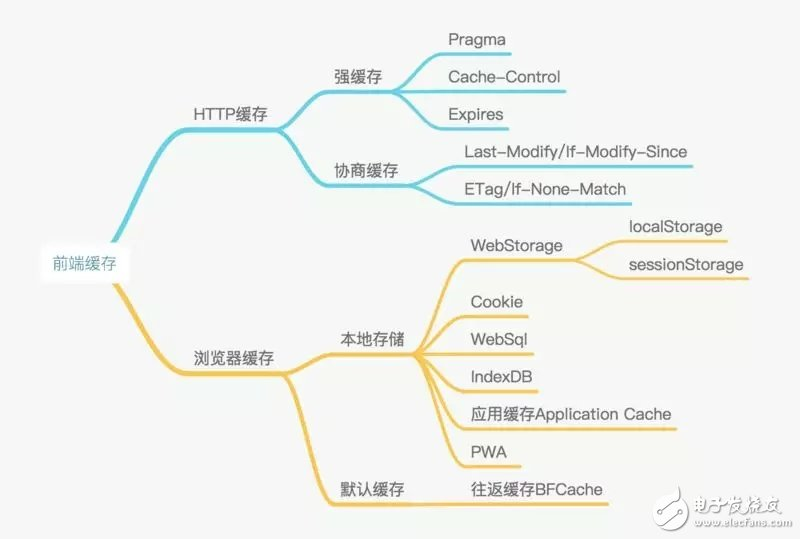

http://www.elecfans.com/emb/1065443.html

前端的缓存主要是分 http 缓存和浏览器缓存

http 缓存就是 在 http 请求传输时用到的缓存  
 主要在服务器代码上设置

     浏览器缓存 主要由前端开发在js上进行设置

http 缓存都是从第二次请求开始
http 缓存又分为 强缓存 状态码 200 和协商缓存 304

浏览器缓存中经常会到 本地存储

cookie 主要用于用户信息存储 ，可设置失效时间，默认是浏览器关闭就失效
每次携带在 http 请求中，

大小 4K 左右

webStorage
一般为 5MB

localstorage 会一直保存在浏览器中，直到用户清楚浏览器缓存数据为止

SessionStorage 当标签被关闭时，就会被清楚

sessionStorage.setItem('key','value')
sessionStorage.getItem('key')
sessionStorage.clear()
sessionStorage.remove('key')

状态码
200 是成功  
300 左右重定向
400 请求错误 ，经常遇到 404
500 服务器错误 ，
