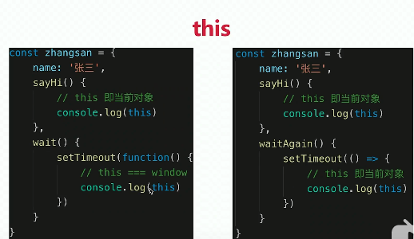

[toc]

#### 1. 说一下对闭包的理解

闭包其实就是
作用域应用的特殊情况
表现在：函数作为参数被传递

函数作为返回值被返回

总结就是函数定义的地方和执行的地方不在一块
闭包表现的两种形式

```
  function test() {
    let a = 100
    return function () {
      console.log(a)
    }
  }
  let b = test()
  b()
```

```
 function test(fn) {
    let a = 300
    fn()
  }
  function fn() {
    console.log(a)
  }
  let a = 400
  test(fn)
```

#### 2.为什么会形成闭包

垃圾回收机制的原因
假如 b 函数作为 a 函数的返回值，返回并保存在外部，这样就行成了闭包，因为 a 函数的作用域是不会被释放的 ，

如果过度的使用闭包就会导致内存泄漏，或加载过慢

<!--
当内部函数被返回到外部并保存时，一定会产生闭包，闭包会产生原来的作用域链不释放
过度的闭包就会内存泄漏，或加载过慢 -->

#### 3. 说以对 this 的理解

this 取什么值，是在函数执行时决定的不是函数定义时决定的
有下面几种情况：
1）作为普通函数调用 指向 window
2）定时器的，属于 windown
3）使用 call,apply,bind，this 指向绑定的值，bind 是返回一个新的函数
4）作为对象方法被调用 this 指向这个对象
5）在 class 方法中被调用 this 指向实例
6）箭头函数 this 指向他的上一级  


#### 4.说一下 call apply bind 的区别

call 需要枚举出来每一项
apply 是传一个数组
bind 是返回函数需要被调用

#### 5.js 中 typeof 可以打印几种数据类型

答案：7 种，number /string /boolean /undefined/object(null)/function /symbol
let s=Symbol()
typeof s

#### 6.js 的基本数据类型

6 种 基本类型 3 中引用类型
number string boolean undefined null symbol
引用类型 object funtion array

#### 7.promise 的理解

promise 是具体来说就是一个构造函数，
是 js 解决异步执行的新方法，
在功能上常见 promise 对象封装一个异步操作并获取其结果

promise 说的简单的就是一个构造函数，是解决异步回调的一种新方法，在项目中用 new Promise 封装一个异步操作，用 then 获取它的结果

#### 8.Promise.all 的实现

#### 9.es6 中数组方法

inclueds Array.from() find findIndex fill keys values

[1, 5, 10, 15].find(function(value, index, arr) {
return value > 9;
})

#### 10.节流和防抖

节流，假如司机控制发车的 5 分钟发车一次，第一个人上来后就及时，然后到 5 分钟后，不管后面有没有，都发车，throttle
防抖：一辆车，10 分钟后发车，如果上来一个人，就清 0 一次时间，直到最后一个人上来后，十分钟后发车 debounce

```
throttle: function (actionFn, delay, mustRunDelay) {//节流阀
        var timer = null, startTime;
        return function () {
            var self = this, args = arguments, currTime = new Date();
            clearTimeout(timer);
            if (!startTime) { startTime = currTime; }
            if (currTime - startTime >= mustRunDelay) {
                actionFn.apply(self, args);
                startTime = currTime;
            } else {
                timer = setTimeout(function () { actionFn.apply(self, args); }, delay);
            }
        };
    }
```

#### 11.跨域的解决方式

1)cors (跨域资源共享)在服务端修改响应头 工作中常用的
res.header('Access-Control-Allow-Origin',"\*")

2)Jsonp 不支持 post 请求
在请求中设置请求的函数
var funcanme=req.query.callback;
动态生成 script 标签，通过 src 属性加载，b 站 ，中国气象网

3)vue 的反向代理
在 vue.config 中配置 proxy
后端 nginx 反向代理

#### 12.http 和 https 的区别

https 是超文本安全传输协议

在 http 上添加了 ssl/xls 的加密
默认 端口 http 80 https 443 ftp 20 21
https 需要申请证书 同是是 加密传输 而 http 是明文传输

#### 13.http1.0 和 http2.0 的区别

http1.0 是一个请求一个响应 解析为 文本传输
http2.o 是 多个请求可同时发送
解析为 二进制流传输

#### 14.设置 setTimeout 延时 5s,它真的会延时 5s 执行吗

不会，因为事件循环机制， setTimeout 是一个宏任务，如果有同步任务或微任务时，会先执行，即使它的等待时间到了，也是在等待队列里，
